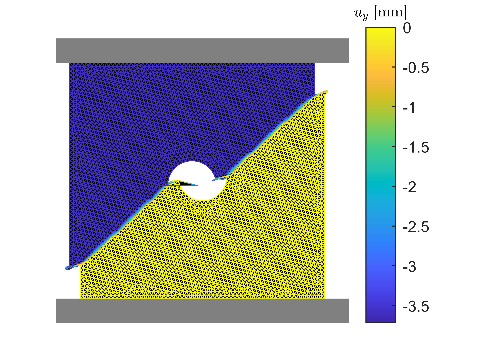
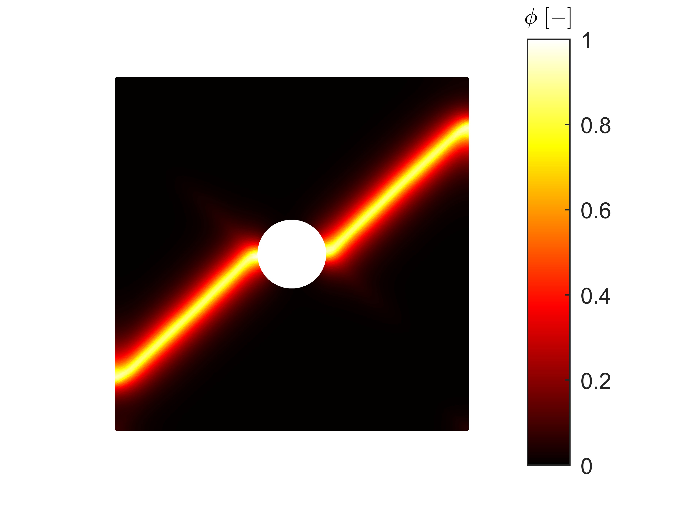
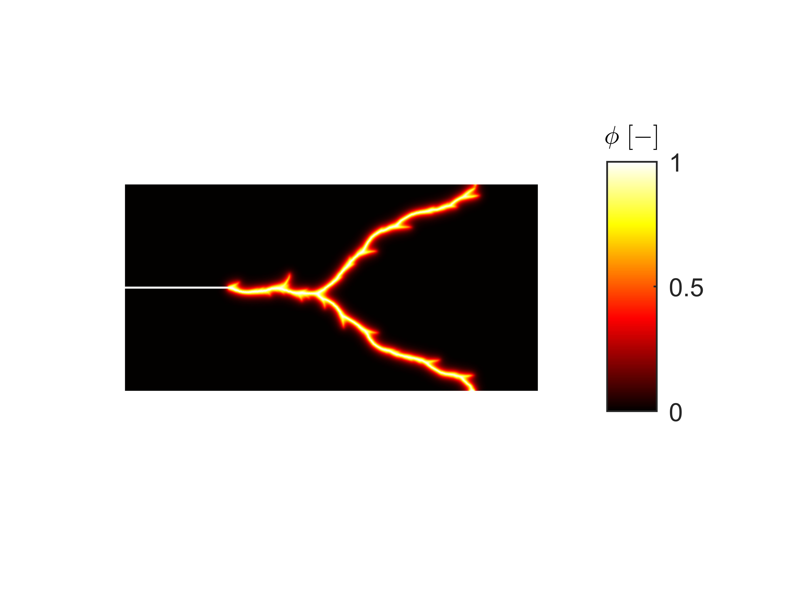

# Cohesive Phase-Field Fracture in FEniCSx


Research code accompanying the paper:

> Tim Hageman, *Cohesive phase-field fracture with an explicit strength surface: an eigenstrain-based return-mapping formulation*.

(currently submitted to Engineering Fracture Mechanics, pre-print: https://arxiv.org/abs/xxxx.yyyy )
This repository provides an open implementation of a cohesive phase-field fracture model built in **FEniCSx / dolfinx**. It is intended to help researchers inspect the formulation, reproduce the benchmark studies from the manuscript, and adapt the implementation for related fracture mechanics problems.

<p align="center">
  
  
  
</p>

Top row, left to right: vertical displacement and phase-field for the plate-with-hole compression benchmark, followed by dynamic crack branching in a single-edge notched plate under sudden traction.

## Simulation code capabilities:

- Implements a cohesive phase-field fracture formulation with an **explicit strength surface**
- Uses an **eigenstrain-based return-mapping update** at quadrature points
- Covers both **quasi-static** and **dynamic** benchmark problems
- Produces reproducible results for the study discussed in the paper

## Project Structure

- `Main.py`: runs a single simulation using the default setup defined in `Params.py`
- `Params.py`: default mesh, material, loading, solver, and output settings
- `Do_Sweep.py`: reproduces the benchmark cases used in the paper
- `Mesh/`: mesh generation, groups, FE spaces, and output utilities
- `Models/`: constitutive models and boundary-condition models
- `Physics/`: coupled problem definitions and assembly logic
- `Solvers/`: time stepping and linear solvers
- `Utils/`: MPI helpers and mathematical utilities
- `PlotFailSurfaces.m`, `PostProcessAnimations.m`: MATLAB post-processing scripts

## Installation

This project requires Python 3.10+ together with an MPI-enabled FEniCSx environment.

Main dependencies:

- `dolfinx`
- `petsc4py`
- `mpi4py`
- `gmsh`
- `numba`
- `threadpoolctl`

Note that FenicsX requires a linux-based system, even when installing through Anaconda. If using windows, use WSL. A conda-based setup is usually the most reliable route:

```bash
conda create -n fenicsx-cohesive python=3.12
conda activate fenicsx-cohesive
conda install -c conda-forge fenics-dolfinx petsc4py mpi4py gmsh numba threadpoolctl
```

If you already have a working FEniCSx + MPI installation, installing the missing Python packages into that environment is also fine.

## Quick Start

Run the default simulation:

```bash
export OMP_NUM_THREADS=1
mpirun -np 50 python3 Main.py
```

The default case is a **plate with a hole** using parameters from `Params.py`. Results are written to `Results/` in HDF5 format.

To explore a different setup, edit `Params.py` and rerun `Main.py`.

## Reproducing The Paper Benchmarks

The repository also includes a benchmark sweep driver:

```bash
export OMP_NUM_THREADS=1
python3 Do_Sweep.py
```

This script is primarily provided for reproducibility. As it is currently set-up, it runs ALL the cases contained within the paper (including mesh refinement studies, parameter sweeps, etc.). This takes a very, very long time, and it is recommended to edit Params.py instead to the parameters/cases of interest to just run that single case.

## Output And Visualisation

Simulation results are plotted during the simulation, and simulation outputs are written to `Results/`, typically as `Outputs_*.hdf5` files. 

For an example of post-processing, see:
- `PostProcessAnimations.m`


## Representative Results

### Plate with hole under compression

A unit square with a central hole is loaded in compression. Stress concentrations around the hole trigger crack nucleation and growth at approximately 45 degrees, while the cohesive formulation suppresses interpenetration across the crack faces.

| Vertical displacement ($u_y$, deformation x10) | Phase-field ($\phi$) |
|:---:|:---:|
|  |  |

### Dynamic crack branching

A single-edge notched plate under sudden normal stress develops branching cracks at low fracture energy. This benchmark illustrates the model's ability to capture rapid crack growth and branching in a dynamic setting.

<p align="center">
  
</p>

## Scope And Maintenance

This repository is best understood as a **research snapshot** accompanying the manuscript rather than as a polished end-user software package. The code is open so that others can:

- verify the implementation,
- reproduce the published studies,
- adapt the methodology to related problems, and
- cite the paper when the code contributes to their work.

## Citation

If this repository is useful in your research, please cite the accompanying paper.

```text
Hageman, T. Cohesive phase-field fracture with an explicit strength surface:
an eigenstrain-based return-mapping formulation. Submitted manuscript.
```

If a DOI, journal reference, or archival release is added later, please use the most up-to-date bibliographic record.

## License

This repository is released under the MIT License. See `LICENSE` for details.
